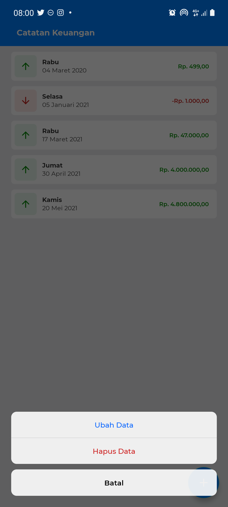
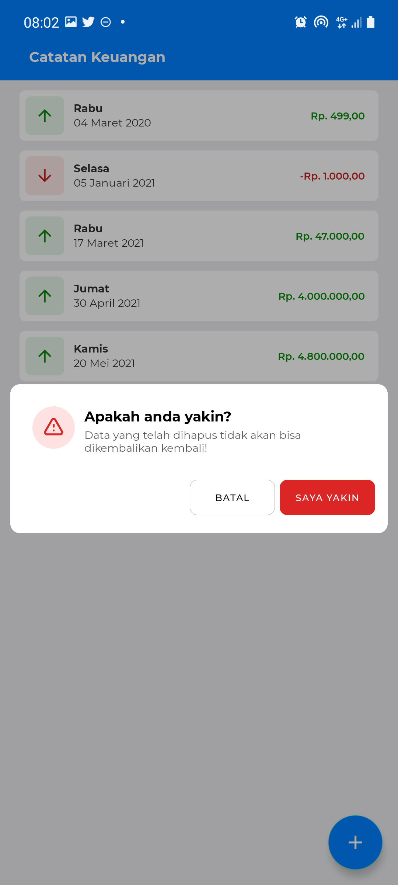

# MVVM-Sales-Record
MVVM - room database implementation (SQLite)

## Author
123180176  
Maulana Kurnia Fiqih Ainul Yaqin

## App Overview
- Home

- Home (Detail List)

- Add Sales Record

- Bottom Sheet

- Change Sales Record

- Dialog Delete

